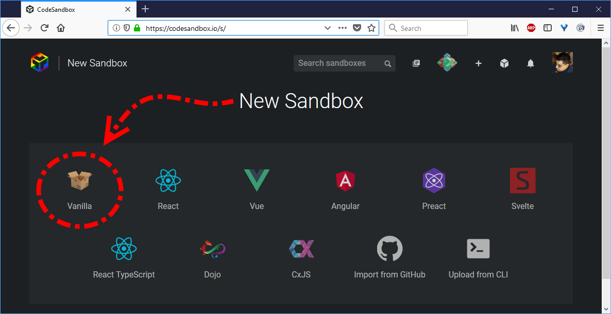
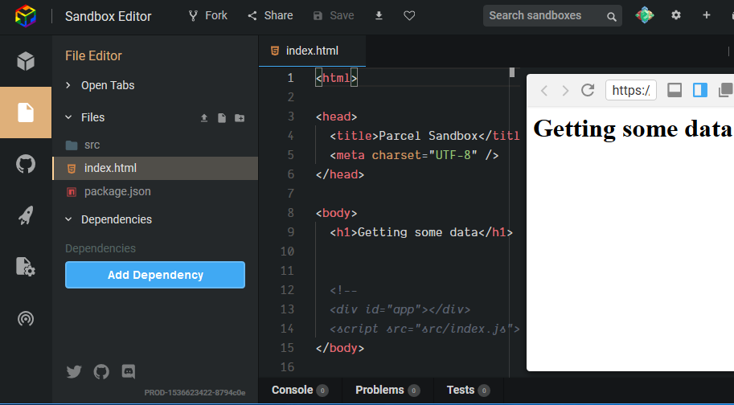

# Exploring NASA APIs
The NASA APIs can be reached from simple JavaScript code.  This guide will walk you through a complete setup to begin this exploration.

## CodeSandbox and GitHub Setup
To use CodeSandbox, you will need a GitHub account.  These are very easy to link and get started with.

### Create GitHub Account
< walkthrough with pictures >

### Create CodeSandbox Account
< walkthrough with pictures >
https://codesandbox.io

### (TODO: Investigate CodeSandbox and GitHub integration so students can collaborate (easy? hard?))

## Create New Sandbox
A "sandbox" is just a place reserved for you to work on files and see the results instantly from your web browser.  It's a convenient way to work and explore how your finished site will look step-by-step.

From the [New Sandbox page](https://codesandbox.io/s/), click Vanilla:



## Exploring Your New Sandbox
The CodeSandbox developer kit creates some files for you that result in a functioning web page.  You will have an index.html to store the layout of your home page.  You will have an index.js file already created with some initial JavaScript.

If you have built HTML files before, even this small sample may seem strange to you.  You don't see the markup for **"Hello Parcel!"** or any of the other text anywhere in index.html.

Even this small sample is using JavaScript to alter the web page after it is loaded.  We will be using this technique to display results from NASA's APIs.

## (TODO: Instructions to comment deafult code ...)

## Add a header to your site
* At the beginning of the `<body>` section, let's add a heading for your site so that the whole section looks like this:
    
```html
<body>
    <h1>Getting some data</h1>
</body>
```

* Save the file. You can use Ctrl-S or find the Save button at the top:

If the browser preview does not refresh automatically, you should be able to refresh it yourself and see your changes.

## Add the jQuery library dependency
We're going to use jQuery to get a library that makes it easier to get data from an API and also to display results on our web page.

* Find the Dependencies section of the File Editor and click the "arrow" to expand it so you can see the Add Dependency button.



* Click the Add Dependency button.
* In the new window that appears, type `jquery`
* Click on the `jquery' dependency (might need a picture here of v3.3.1)

This adds jQuery to the list of dependencies, which is just a fancy way of saying that we can use the jQuery library in any JavaScript file we choose.


